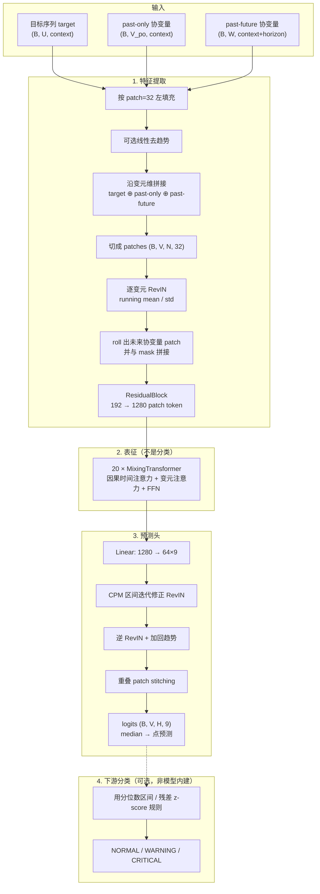
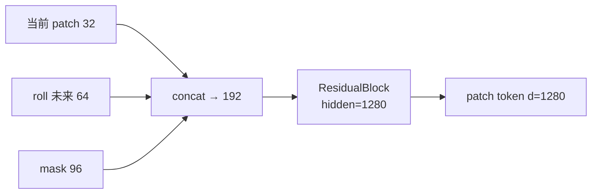
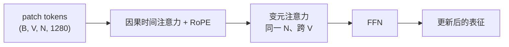
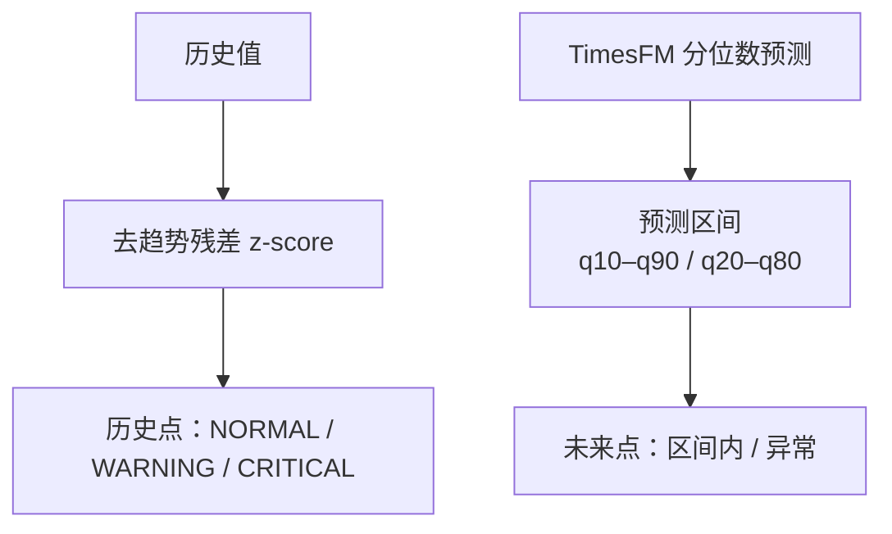

# TimesFM

TimesFM (Time Series Foundation Model) is a pretrained time-series foundation
model developed by Google Research for time-series forecasting.

*   Paper:
    [A decoder-only foundation model for time-series forecasting](https://arxiv.org/abs/2310.10688),
    ICML 2024.
*   <span style="color:red">(NEW!)</span> TimesFM 3.0 Checkpoint:
    [`google/timesfm-3.0-pytorch`](https://huggingface.co/google/timesfm-3.0-pytorch).
*   Checkpoints (up to 2.5):
    [TimesFM Hugging Face Collection](https://huggingface.co/collections/google/timesfm-release-66e4be5fdb56e960c1e482a6).
*   [Google Research blog](https://research.google/blog/a-decoder-only-foundation-model-for-time-series-forecasting/)
    (New blog post for TimesFM 3.0 coming soon!).
*   TimesFM in Google 1P Products:
    *   [BigQuery ML](https://cloud.google.com/bigquery/docs/timesfm-model):
        Enterprise level SQL queries for scalability and reliability.
    *   [Google Sheets](https://workspaceupdates.googleblog.com/2026/02/forecast-data-in-connected-sheets-BigQueryML-TimesFM.html):
        For your daily spreadsheet.
    *   [Vertex Model Garden](https://console.cloud.google.com/vertex-ai/publishers/google/model-garden/timesfm):
        Dockerized endpoint for agentic calling.

This open version is not an officially supported Google product.

**Latest Model Version:** TimesFM 3.0

**Archived Model Versions:**

-   2.5: relevant code under `src/timesfm`.
-   1.0 and 2.0: relevant code archived in the subdirectory `v1`. You can `pip
    install timesfm==1.3.0` to install an older version of this package to load
    them.

--------------------------------------------------------------------------------

## Update — August 2026

**TimesFM 3.0 is out!**

TimesFM 3.0 introduces native **multivariate time-series forecasting**, flexible
**covariate support** (both past-only and past-and-future covariates), superior
zero-shot generalist capabilities, and top performance across all three major
time-series foundation model benchmarks.

### Key Highlights:

-   **Native Multivariate & Univariate Forecasting with Covariates**: Seamlessly
    forecast multi-channel multivariate series as well as individual univariate
    series, with native support for past-only and past-and-future dynamic
    covariates without per-task tuning.
-   **Top Benchmark Performance**:
    -   🥇 **fev-bench**: **Rank #1 overall** across 100 diverse real-world
        forecasting tasks.
    -   🥇 **TIME Benchmark**: **Rank #1 overall** across 50 domain datasets and
        98 evaluation tasks.
    -   🥇 **GIFT-Eval**: **Rank #1 among all foundation models**.

### License notice for pretrained weights

> **Important:** The TimesFM source code in this repository is licensed under
> Apache-2.0, and model weights up to version 2.5 remain Apache-2.0. However,
> for the time being, TimesFM 3.0 pretrained weights are distributed under the
> separate `timesfm-non-commercial-license-v1.0` license and are restricted to
> non-commercial, non-production use. Commercial or production use of the
> default pretrained weights is **not permitted**.

--------------------------------------------------------------------------------

## TimesFM 3.0 架构：特征提取、预测与下游分类

TimesFM 3.0（`google/timesfm-3.0-pytorch`，约 330M）是 **decoder-only 的时间序列基础模型**。
原生任务是 **一次前向完成的概率预测**（点预测 + 9 个分位数），**没有独立的分类 head**。
异常检测、阈值告警等“分类”是在分位数预测之上用规则做的下游任务。

实现主要在 `src/timesfm3/torch/model.py`（`TimesFM3Torch`）与
`src/timesfm3/torch/transformer.py`（`MixingTransformer`）。

### 模型规格（当前 checkpoint）

| 项 | 值 |
| --- | --- |
| 层数 / 宽度 / 头数 | 20 层 Mixing Transformer，`d=1280`，16 heads |
| 输入 / 输出 patch | 32 / 64（`rolls = 64/32 = 2`） |
| 分位数 | `0.1 … 0.9`（9 个；**median 在 index 4，作为点预测**） |
| 变元上限 | 32（目标 + past-only + past-future covariates 合计） |
| 上下文上限 | 15,360 个时间点 |
| 注意力 | 时间维 **因果** + 变元维 **全连接**（同一时刻跨通道） |

### 总览



### 1. 如何提取特征

数据被当成 **patch token**，而不是逐步 RNN 状态。

1. **对齐长度**  
   context 左 pad 到 32 的倍数；horizon 按 stitching 需要 pad。horizon 上的目标值全部 mask（未知），past-future 协变量在 horizon 上保持可见。

2. **变元堆叠**  
   目标、只在历史上已知的协变量、历史上+未来都已知的协变量，沿 `V` 维拼成一张多通道序列。变元注意力在这一维上交互。

3. **可选线性去趋势**  
   若去趋势后的标准差明显小于原序列（默认阈值 0.5），则减去拟合直线；预测后再加回。

4. **RevIN**  
   每个变元用 running mean/std 做实例归一化，让不同量纲进入同一表示空间。horizon 上可用 **Contiguous Patch Masking (CPM)**：目标 patch 被 mask，用上下文统计量（并可迭代用模型估计值修正）。

5. **Patch 嵌入（真正的“特征提取层”）**  
   每个时间 patch 拼接：
   - 当前 32 点（RevIN 后）
   - 向未来 roll 得到的 64 点（给已知的 future covariates 用；目标位置为 0）
   - 对应的 32+64 点 mask  
   得到长度 `2×(32+64)=192` 的向量，送入 **ResidualBlock**（两层线性 + ReLU + 残差）→ **1280 维 patch token**。



### 2. Mixing Transformer 在学什么（表征，不是类别）

每一层对 `(B, V, N, 1280)` 的 token 做：

1. **时间注意力（因果 + RoPE）**  
   每个变元独立：第 `t` 个 patch 只能看 `≤ t`。建模趋势、季节、水平漂移。
2. **变元注意力（同一时刻、跨通道、非因果）**  
   让多个目标与协变量在同一 patch 上交换信息。这是 3.0 相对 2.x 单变量模型的核心。
3. **FFN**  
   RMSNorm + ReLU MLP，残差连接。

堆叠 20 层后，每个 patch token 是该位置的条件表征，供预测头使用。模型 **不输出类别 logits**。



### 3. 如何做预测

一次 `decode()` **非自回归**：horizon 上的目标 patch 用 CPM mask 掉，整段 context+horizon 只走一遍 Transformer。

1. **输出头**  
   `Linear(1280 → 64×9)`，每个输入 patch 预测一个长度为 64 的未来窗口，9 个分位数。
2. **逆变换**  
   分位数在 RevIN 空间；用（可经 CPM 迭代修正的）mean/std 逆归一化，再加回去趋势。
3. **Stitching**  
   相邻预测窗口重叠 32 点，拼出任意 `horizon`（可超过 64）。
4. **读出**  
   - 点预测：`quantiles[..., 4]`（0.5 分位）  
   - 概率预测：9 条分位轨迹，用于区间、校准、下游规则  

对应代码：`TimesFM3Torch.decode()` → `forward()` → `TimesFM3Forecaster.predict_batch()`。

### 4. “分类”怎么来（下游，不是预训练目标）

预训练与 zero-shot 推理都是 **分位数回归 / 预测**。若需要分类，在预测结果上套规则，例如仓库里的异常检测示例
（`timesfm-forecasting/examples/anomaly-detection/`）：

| 阶段 | 做法 | 标签 |
| --- | --- | --- |
| 历史段 | 线性去趋势后的残差 z-score | `\|z\|≥3` CRITICAL，`≥2` WARNING，否则 NORMAL |
| 未来段 | 观测是否落在 TimesFM 的 q10–q90 / q20–q80 之外 | 区间外 → 异常，否则正常 |



若要做真正的可学习分类（工况、故障类型等），需要 **另加分类头并微调**；当前公开的 3.0 权重不含该头。

--------------------------------------------------------------------------------

## Update - July 2, 2026

Updated PyPI to `timesfm=2.0.2`. See
[Install](https://github.com/google-research/timesfm#from-pypi).

## Update - Apr. 9, 2026

Added fine-tuning example using HuggingFace Transformers + PEFT (LoRA) — see
[`timesfm-forecasting/examples/finetuning/`](timesfm-forecasting/examples/finetuning/).
Also added unit tests (`tests/`) and incorporated several community fixes.

Shoutout to [@kashif](https://github.com/kashif) and
[@darkpowerxo](https://github.com/darkpowerxo).

## Update - Mar. 19, 2026

Huge shoutout to [@borealBytes](https://github.com/borealBytes) for adding the
support for
[AGENTS](https://github.com/google-research/timesfm/blob/master/AGENTS.md)!
TimesFM
[SKILL.md](https://github.com/google-research/timesfm/tree/master/timesfm-forecasting)
is out.

## Update - Oct. 29, 2025

Added back the covariate support through XReg for TimesFM 2.5.

## Update - Sept. 15, 2025

TimesFM 2.5 is out!

Comparing to TimesFM 2.0, this new 2.5 model:

-   uses 200M parameters, down from 500M.
-   supports up to 16k context length, up from 2048.
-   supports continuous quantile forecast up to 1k horizon via an optional 30M
    quantile head.
-   gets rid of the `frequency` indicator.
-   has a couple of new forecasting flags.

Since the Sept. 2025 launch, the following improvements have been completed for
TimesFM 2.5:

1.  ✅ Flax version of the model for faster inference.
2.  ✅ Covariate support via XReg (see Oct. 2025 update).
3.  ✅ Documentation, examples, and agent skill (see `timesfm-forecasting/`).
4.  ✅ Fine-tuning example with LoRA via HuggingFace Transformers + PEFT (see
    `timesfm-forecasting/examples/finetuning/`).
5.  ✅ Unit tests for core layers, configs, and utilities (see `tests/`).

### Install

#### From `PyPI`

```shell
# Install TimesFM with PyTorch
pip install timesfm[torch]

# Or, for MLX-native inference on Apple silicon (no PyTorch required)
pip install timesfm[mlx]
```

#### Local Install

1.  Clone the repository:

    ```shell
    git clone https://github.com/google-research/timesfm.git
    cd timesfm
    ```

2.  Create a virtual environment and install with PyTorch:

    ```shell
    # Using uv
    uv venv
    source .venv/bin/activate

     # Install the package in editable mode with torch
    uv pip install -e .[torch]
    ```

--------------------------------------------------------------------------------

### Code Examples: TimesFM 3.0

#### 1. Univariate Forecasting (Variable Lengths)

Pass a batch of 1D NumPy arrays of different context lengths to forecast
univariate time series:

```python
import numpy as np
from timesfm3 import TimesFM3Evaluator, ModelConfig

# Initialize TimesFM 3.0
config = ModelConfig(
    checkpoint_path="google/timesfm-3.0-pytorch",
    per_core_batch_size=32,
    device="cuda"
)
forecaster = TimesFM3Evaluator(config)

# Two univariate series of different lengths (100 and 72 steps)
ts1 = np.linspace(0, 1, 100).astype(np.float32)
ts2 = np.sin(np.linspace(0, 24, 72)).astype(np.float32)

# Generate forecast (point predictions + 9 quantiles: 0.1 to 0.9)
outputs = list(forecaster.predict_batch([ts1, ts2], horizon=12, return_quantiles=True, use_symmetric_averaging=False))

print("Series 1 forecast shape:", outputs[0].forecast.shape)   # (12,)
print("Series 1 quantiles shape:", outputs[0].quantiles.shape) # (12, 9)

print("Series 2 forecast shape:", outputs[1].forecast.shape)   # (12,)
print("Series 2 quantiles shape:", outputs[1].quantiles.shape) # (12, 9)
```

#### Apple Silicon: MLX backend

An MLX-native backend runs TimesFM 3.0 on Apple silicon without PyTorch. It mirrors the PyTorch
`TimesFM3Forecaster` interface (`predict` / `predict_batch`, univariate or multivariate, with
past-only and past-future covariates) and is numerically matched to it on
`google/timesfm-3.0-pytorch`. Median forecast / quantile max abs error, context 512: `9.5e-7` /
`1.8e-6` at horizon 64, `2.3e-6` / `2.7e-6` at horizon 128 (longer horizons stitch multiple output
patches, so they are worth checking on their own).

```python
import numpy as np
from timesfm3.mlx import TimesFM3Forecaster

forecaster = TimesFM3Forecaster.from_pretrained("google/timesfm-3.0-pytorch")

# Univariate, long horizon (>= 128 spans several output patches).
context = np.sin(np.linspace(0, 40, 512)).astype(np.float32)
out = forecaster.predict(context, horizon=128, return_quantiles=True)
print(out.forecast.shape)    # (128,)      median forecast
print(out.quantiles.shape)   # (128, 9)    9 deciles

# Batch many series through one forward pass.
outs = list(forecaster.predict_batch([context] * 32, horizon=128))
```

Multivariate targets and covariates work the same way as on the PyTorch backend (matched to
`1.7e-6` on the checkpoint):

```python
context_len, horizon = 256, 32

# Two target variates: (num_variates, context_len).
target = np.stack([
    np.sin(np.linspace(0, 24, context_len)),
    np.sin(np.linspace(1, 26, context_len)),
]).astype(np.float32)

past_only = np.random.randn(1, context_len).astype(np.float32)          # (1, 256)
past_future = np.sin(                                                    # (1, 256 + 32)
    np.linspace(0, 30, context_len + horizon)
)[None, :].astype(np.float32)

out = forecaster.predict(
    target,
    horizon=horizon,
    past_only_covariates=past_only,
    past_future_covariates=past_future,
    return_quantiles=True,
)
print(out.forecast.shape)    # (2, 32)     one forecast per target variate
print(out.quantiles.shape)   # (2, 32, 9)
```

Benchmarks (330M model, Apple M4 Max, context 512, horizon 64, fp32 with `mx.compile`):

| batch | p50 latency | throughput |
|------:|------------:|-----------:|
|     1 |     11.1 ms |   90 series/s |
|     8 |     19.7 ms |  406 series/s |
|    32 |     48.1 ms |  666 series/s |

Contexts longer than `global_context` (15,360) are truncated to their most recent points before
decode, matching the PyTorch backend. `use_symmetric_averaging`, `use_znorm`, and `padding_mode`
(`"none"` / `"edge"`) are all supported and numerically matched to the PyTorch backend, so the MLX
forecaster is a drop-in for the univariate and covariate forecasting paths.

#### 2. Multivariate Forecasting with Covariates

Pass a 2D array of shape `(num_variates, context_length)` along with optional
past-only and past-and-future covariates:

```python
import numpy as np
from timesfm3 import TimesFM3Evaluator, ModelConfig

# Initialize TimesFM 3.0
config = ModelConfig(
    checkpoint_path="google/timesfm-3.0-pytorch",
    per_core_batch_size=16,
    device="cuda"
)
forecaster = TimesFM3Evaluator(config)

context_len = 128
horizon = 24

# 3 target variates across past context: (3, 128)
target = np.random.randn(3, context_len).astype(np.float32)

# 1 past-only covariate channel across past context: (1, 128)
past_only_cov = np.random.randn(1, context_len).astype(np.float32)

# 2 past-and-future covariate channels across context + horizon: (2, 152)
past_future_cov = np.random.randn(2, context_len + horizon).astype(np.float32)

# Generate joint forecast across all 3 target variates
outputs = list(
    forecaster.predict_batch(
        contexts=[target],
        horizon=horizon,
        past_only_covariates=[past_only_cov],
        past_future_covariates=[past_future_cov],
        return_quantiles=True,
        use_symmetric_averaging=False,
    )
)

print("Multivariate forecast shape:", outputs[0].forecast.shape)   # (3, 24)
print("Multivariate quantiles shape:", outputs[0].quantiles.shape) # (3, 24, 9)
```
